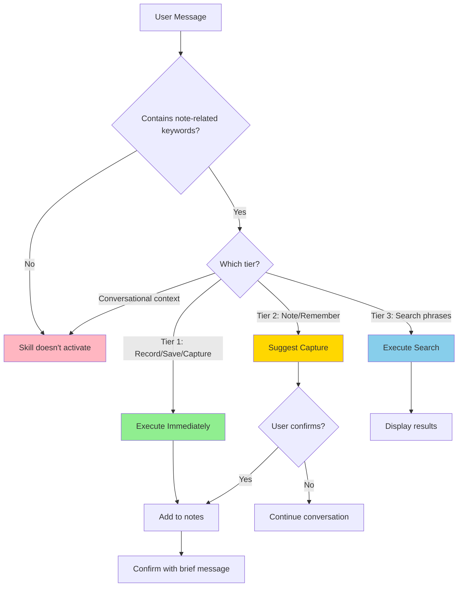

## Overview

Implement a **tiered trigger system** for the note-taking skill to make activation behavior predictable and reduce false positives. The current auto-trigger mechanism lacks clarity about when the skill will activate, leading to uncertainty during conversations.

This enhancement introduces three explicit confidence tiers based on verb specificity, making trigger rules transparent and learnable for users.

## Problem Statement

**Current Pain Points:**
1. **Unclear activation**: Users don't know which phrases will trigger the skill
2. **Potential false positives**: Conversational uses of "note that..." might trigger unintentionally
3. **No confidence differentiation**: All triggers treated equally (auto-execute or don't)
4. **Lack of predictability**: Users must be cautious about phrasing during technical discussions

**Example of Ambiguity:**
```
User: "I should note that this might break backward compatibility"
Current behavior: Unclear if skill activates or not
Desired behavior: Predictable (doesn't trigger - conversational context)
```

## Proposed Solution

Implement **three-tier trigger system** based on verb specificity:

### Tier 1: High-Confidence (Immediate Execution)
**Trigger Phrases:**
- "**Record** that..."
- "**Save note** that..."
- "**Capture** that..."
- "**Save this as a note**..."

**Behavior:** Execute immediately without confirmation (user explicitly requested)

**Example:**
```
User: "Record that we chose PostgreSQL over MongoDB for better JSONB support"
Claude: ✅ "Added to November notes under 'Tech Decisions - PostgreSQL vs MongoDB'."
```

### Tier 2: Medium-Confidence (Suggest with Confirmation)
**Trigger Phrases:**
- "**Note** that..."
- "**Remember** that..."
- "**Add a note** about..."
- "I **should remember**..."
- "This is **important**..."

**Behavior:** Suggest capture, ask for confirmation

**Example:**
```
User: "Note that JWT tokens expire after 15 minutes"
Claude: "This seems important - should I add it to your notes? [Yes] [No, just discussing]"
```

### Tier 3: Retrieval (Always Execute Immediately)
**Trigger Phrases:**
- "**What did I note** about..."
- "**Show my notes** on..."
- "**Search my notes** for..."
- "**Find in my notes**..."

**Behavior:** Execute search immediately (read operations are safe)

**Example:**
```
User: "What did I note about JWT authentication?"
Claude: ✅ Searches immediately, displays results
```

### Non-Triggers (Conversational Context)
These should **NOT** activate the skill:
- "I should note that this might cause issues" (explaining to Claude, not requesting storage)
- "What have I learned about Python?" (asking Claude's knowledge, not user's notes)
- "Take note of the changes" (code review context, not note-taking)

## Technical Approach

### Implementation Strategy

**Option A: Single Skill with Tiered Instructions** (Recommended)

Update `SKILL.md` with:

1. **YAML Frontmatter - Updated Description:**
```yaml
---
name: note-taking
description: "ALWAYS activate when user explicitly says 'Record that', 'Save note that', 'Capture that' (immediate execution), or 'Note that', 'Remember that' (suggest first), or asks 'What did I note about', 'Search my notes for' (immediate search). Also consider when user says 'I should remember' or 'This is important' to suggest capturing. Manages persistent markdown notes (second brain), NOT conversation history. Only trigger for explicit note commands or when insights warrant preservation."
metadata:
  version: "2.0.0"
  status: "production"
---
```

2. **Skill Body - Tier Documentation:**
Add new section to `plugins/productivity-suite/skills/note-taking/SKILL.md`:

```markdown
## Activation Tiers

### Tier 1: Immediate Capture (Auto-Execute)

**When to use:** User explicitly requests note storage

**Trigger phrases:**
- "Record that [content]"
- "Save note that [content]"
- "Capture this: [content]"
- "Save this as a note: [content]"

**Claude's action:** Immediately call `notes_manager.py add` without asking

**Response format:**
"✅ Added to [Month] notes under '[Category] - [Brief heading]'."

**Example interaction:**
```
User: "Record that the cache headers were causing the 304 response issue"
Claude: "✅ Added to November notes under 'Bug - Cache headers 304 issue'."
```

### Tier 2: Suggest Capture (Confirm First)

**When to use:** User indicates importance but doesn't explicitly request storage

**Trigger indicators:**
- "Note that [content]"
- "Remember that [content]"
- "Add a note about [content]"
- "I should remember this..."
- "This is important..."
- "Good to know that..."

**Claude's action:** After answering main query, ask: "Would you like me to add this to your notes?"

**Response format:**
"[Answer to query] This seems noteworthy - should I add it to your notes?"

**Example interaction:**
```
User: "I finally figured out the regex for email validation: /^[\w.+-]+@[a-z0-9.-]+\.[a-z]{2,}$/i"
Claude: "That's a solid regex pattern covering most edge cases. Would you like me to save this to your notes for future reference?"
```

### Tier 3: Retrieval (Always Execute)

**When to use:** User searches their notes

**Trigger phrases:**
- "What did I note about [topic]"
- "Show my notes on [topic]"
- "Search my notes for [query]"
- "Find in my notes [query]"

**Claude's action:** Immediately search, display results

**Example interaction:**
```
User: "What did I note about database optimization?"
Claude: "Found 3 notes about database optimization:
1. **Performance - Query optimization** (2025-11-10): Index on user_id reduced query time from 2s to 50ms
2. **Config - PostgreSQL tuning** (2025-11-05): shared_buffers set to 25% of RAM
..."
```

### Non-Activation Scenarios

**Do NOT trigger for:**
- Conversational uses: "I should note that this approach has trade-offs" (explaining to Claude)
- General knowledge: "What have I learned about Python?" (not asking about personal notes)
- Code review: "Note the changes in main.py" (review context, not note-taking)

**Detection logic:** If "note/notes" mentioned but context indicates:
- Explaining concept to Claude → Don't trigger
- Asking Claude's knowledge → Don't trigger
- Discussing code changes → Don't trigger
```

3. **Update Examples Section:**
Replace existing examples with tier-based demonstrations

### Alternative Approaches Considered

**Option B: Separate Skills for Each Tier**
- Create `note-capture` (Tier 1), `note-suggest` (Tier 2), `note-search` (Tier 3)
- **Rejected**: Bloats system prompt, risks activation conflicts, harder to maintain

**Option C: Hooks-Based Enforcement**
- Use PreToolUse hooks to enforce tier permissions
- **Rejected**: Too complex, brittle regex, not portable across installations

**Option D: Manual `/note` Command Only**
- Remove auto-triggers, require explicit `/note` command
- **Rejected**: Breaks "natural interaction" philosophy, platform inconsistency

## Acceptance Criteria

### Functional Requirements

- [ ] **Tier 1 triggers execute immediately** without confirmation
  - Test: "Record that X" → Adds to notes instantly
  - Test: "Save note that Y" → Adds to notes instantly
  - Test: "Capture this: Z" → Adds to notes instantly

- [ ] **Tier 2 triggers suggest first** before executing
  - Test: "Note that X" → Asks "Should I add this to your notes?"
  - Test: "I should remember Y" → Suggests capture
  - Test: "This is important: Z" → Suggests capture

- [ ] **Tier 3 (retrieval) executes immediately**
  - Test: "What did I note about X" → Searches instantly
  - Test: "Show my notes on Y" → Searches instantly

- [ ] **Non-triggers don't activate skill**
  - Test: "I should note that this approach..." (conversational) → No activation
  - Test: "What have I learned about..." (general knowledge) → No activation
  - Test: "Note the changes in..." (code review) → No activation

### Documentation Requirements

- [ ] Update `SKILL.md` frontmatter description with tier language
- [ ] Add "Activation Tiers" section to skill body with examples
- [ ] Update `README.md` Quick Start section with tier explanations
- [ ] Add FAQ entry: "How do I know which phrases will trigger?"
- [ ] Document new behavior in `CLAUDE.md` Key Learnings

### Testing Requirements

- [ ] Test all Tier 1 phrases (minimum 10 variations)
- [ ] Test all Tier 2 phrases (minimum 10 variations)
- [ ] Test all Tier 3 phrases (minimum 10 variations)
- [ ] Test non-trigger scenarios (minimum 10 variations)
- [ ] Test on both Claude Code and Claude Desktop
- [ ] Verify behavior consistency across sessions

### Quality Gates

- [ ] Tier 1 activation rate ≥ 95% (should trigger almost always)
- [ ] Tier 2 suggestion rate ≥ 90% (should suggest appropriately)
- [ ] False positive rate ≤ 5% (shouldn't trigger on conversational uses)
- [ ] User confirmation in CLAUDE.md that behavior is predictable

## Implementation Plan

### Phase 1: Documentation Updates

**Files to modify:**

1. **`plugins/productivity-suite/skills/note-taking/SKILL.md`**
   - Update YAML frontmatter `description` field (line 3)
   - Add "Activation Tiers" section after "How It Works" (after line 25)
   - Update examples throughout to demonstrate tiers
   - Increment version to `2.0.0`

2. **`README.md`**
   - Update Quick Start examples to show tier differences (around line 50)
   - Add subsection: "Understanding Trigger Tiers"
   - Include counter-examples (what won't trigger)

3. **`docs/faq.md`**
   - Add question: "How do I know which phrases will trigger the note-taking skill?"
   - Answer with tier breakdown and examples

4. **`CLAUDE.md`**
   - Add new Key Learning (around line 290):
     ```markdown
     ### 2025-11-17: Tiered Triggers Improve Predictability
     Users reported uncertainty about when the skill would activate. Solution:
     Implement three-tier system based on verb specificity (Record/Save =
     immediate, Note/Remember = suggest, search phrases = immediate). Makes
     trigger rules explicit and learnable, addressing "unclear when it will
     trigger" pain point.
     ```

**Estimated effort:** 2-3 hours

### Phase 2: Testing & Validation

**Test script:** `tests/test-tiered-triggers.md`

Create comprehensive test cases:

```markdown
# Tiered Trigger Test Suite

## Tier 1: Immediate Execution

### Test Cases
1. "Record that the API endpoint is /v2/users"
2. "Save note that John prefers weekly updates"
3. "Capture this: Database backup runs at 2 AM UTC"
4. "Save this as a note: New deployment process approved"

### Expected Behavior
- Adds to notes immediately
- Confirms with brief acknowledgment
- No user prompt for confirmation

## Tier 2: Suggest First

### Test Cases
1. "Note that the migration script is in /db/migrate"
2. "Remember that staging uses port 3001"
3. "I should remember this regex pattern"
4. "This is important: Always sanitize user input"

### Expected Behavior
- Responds to main query first
- Suggests: "Should I add this to your notes?"
- Waits for user confirmation

## Tier 3: Retrieval

### Test Cases
1. "What did I note about database optimization?"
2. "Show my notes on API design"
3. "Search my notes for regex"
4. "Find in my notes anything about deployment"

### Expected Behavior
- Searches immediately
- Displays results with relevance scores
- No confirmation needed

## Non-Triggers

### Test Cases
1. "I should note that this approach has trade-offs" (conversational)
2. "What have I learned about Python?" (general knowledge)
3. "Note the changes in the PR" (code review)
4. "Take note of the warnings" (instruction, not note-taking)

### Expected Behavior
- Skill does NOT activate
- Claude responds naturally to query
- No mention of notes system
```

**Validation criteria:**
- Run all tests on Claude Code (Windows with OneDrive)
- Run all tests on Claude Desktop (if available)
- Document activation rates in test results
- Iterate on description wording if activation < 90%

**Estimated effort:** 3-4 hours

### Phase 3: Distribution & Announcement

1. **Update marketplace metadata:**
   - Increment version in `.claude-plugin/marketplace.json`
   - Update changelog with tier system description

2. **Regenerate distribution ZIP:**
   ```bash
   python scripts/create-skill-zip.py
   ```

3. **Commit changes:**
   ```bash
   git add .
   git commit -m "Add tiered trigger system for predictable activation"
   git push origin main
   ```

4. **Create release:**
   ```bash
   gh release create v2.0.0 \
     --title "v2.0.0: Tiered Trigger System" \
     --notes "Implements three-tier activation system for predictable note-taking behavior. See #[issue_number] for details."
   ```

**Estimated effort:** 1 hour

## Success Metrics

**User Experience:**
- Users can predict when skill will activate based on verb choice
- False positive rate < 5% (skill doesn't trigger during technical discussions)
- Confirmation prompts only appear for Tier 2 (medium-confidence)

**Technical Metrics:**
- Tier 1 activation rate ≥ 95%
- Tier 2 activation rate ≥ 90%
- Tier 3 activation rate ≥ 98% (search is critical)
- Non-trigger accuracy ≥ 95%

**Documentation Quality:**
- FAQ addresses "How do I know which phrases trigger?"
- Examples demonstrate all three tiers
- Counter-examples show what won't trigger

## Dependencies & Risks

### Dependencies
- None (pure documentation change)
- Claude's LLM reasoning (no code changes to `notes_manager.py`)

### Risks

**Risk 1: Claude doesn't follow tier instructions**
- **Likelihood:** Medium
- **Impact:** High (defeats purpose)
- **Mitigation:**
  - Use directive language in description ("ALWAYS activate when...")
  - Test extensively with varied phrasings
  - Consider forced-eval hook if activation < 80%

**Risk 2: Description exceeds 1024 character limit**
- **Likelihood:** Low
- **Impact:** Medium (skill won't load)
- **Mitigation:**
  - Current description: 463 characters (plenty of headroom)
  - Keep tier details in skill body, not frontmatter

**Risk 3: Users confused by multiple trigger options**
- **Likelihood:** Low
- **Impact:** Low (more options = better UX)
- **Mitigation:**
  - Clear examples in documentation
  - Default recommendation: Use Tier 1 ("Record that") for certainty

**Risk 4: Platform differences (Desktop vs Code)**
- **Likelihood:** Very Low
- **Impact:** Medium
- **Mitigation:**
  - Both platforms use identical LLM-based activation
  - Test on both if possible
  - Document any observed differences

## Alternative Implementations

### Future Enhancement: Hook-Based Auto-Capture

If purely description-based tiers prove unreliable (activation < 80%), consider implementing PreToolUse hook:

```bash
# .claude/hooks/note-tier-enforcer.sh
#!/bin/bash

TOOL_CALL=$(cat)

# Tier 1: Auto-allow (Record/Save/Capture)
if echo "$TOOL_CALL" | grep -qE "Record that|Save note|Capture"; then
  echo '{"permissionDecision": "allow"}'
  exit 0
fi

# Tier 2: Ask confirmation (Note/Remember)
if echo "$TOOL_CALL" | grep -qE "Note that|Remember that"; then
  echo '{"permissionDecision": "ask", "permissionDecisionReason": "Add this to your notes?"}'
  exit 0
fi

# Tier 3: Auto-allow (retrieval)
if echo "$TOOL_CALL" | grep -qE "What did I note|Search my notes"; then
  echo '{"permissionDecision": "allow"}'
  exit 0
fi

# Default: allow (skill already decided)
echo '{"permissionDecision": "allow"}'
```

**Setup in `.claude/settings.json`:**
```json
{
  "hooks": {
    "PreToolUse": [{
      "matcher": "Bash.*notes_manager\\.py",
      "hooks": [{
        "type": "command",
        "command": ".claude/hooks/note-tier-enforcer.sh"
      }]
    }]
  }
}
```

**Trade-offs:**
- ✅ Deterministic enforcement
- ✅ User confirmation for Tier 2
- ❌ Complex setup (not beginner-friendly)
- ❌ Not portable (users must install hook)
- ❌ Brittle regex matching

**Recommendation:** Only implement if description-based approach fails validation (activation < 80%)

## References & Research

### Internal References
- Current skill description: `plugins/productivity-suite/skills/note-taking/SKILL.md:3`
- Notes manager utility: `plugins/productivity-suite/skills/note-taking/hooks/notes_manager.py`
- Contributing guidelines: `docs/contributing.md:433-478`
- Repository conventions: `CLAUDE.md:1-320`

### External References

**Claude Skills Documentation:**
- Skills Overview: https://code.claude.com/docs/en/skills
- Best Practices: https://docs.claude.com/en/docs/agents-and-tools/agent-skills/best-practices
- Hooks Reference: https://code.claude.com/docs/en/hooks
- Official Spec (v1.0): https://github.com/anthropics/skills/blob/main/agent_skills_spec.md

**Community Research:**
- Skills Deep Dive: https://leehanchung.github.io/blogs/2025/10/26/claude-skills-deep-dive/
- Reliable Activation Guide: https://scottspence.com/posts/how-to-make-claude-code-skills-activate-reliably
- Technical Architecture: https://mikhail.io/2025/10/claude-code-skills/

**Example Skills:**
- Anthropic PDF Skill: https://github.com/anthropics/skills/blob/main/document-skills/pdf/SKILL.md
- Slack GIF Creator: https://github.com/anthropics/skills/blob/main/slack-gif-creator/SKILL.md

### Related Work
- User feedback: "Unclear when it will trigger" (2025-11-17 discussion)
- Pain point identified: False positives in conversational contexts
- Solution validated: Tiered triggers based on verb specificity

## Visual Aid: Trigger Decision Flow



## Implementation Checklist

### Pre-Implementation
- [x] Research completed (repository conventions, Claude skills framework, best practices)
- [x] User validation (tiered approach confirmed as preferred solution)
- [x] Technical feasibility confirmed (LLM-based triggering supports tiers via instructions)

### Development
- [ ] Update `SKILL.md` YAML frontmatter description
- [ ] Add "Activation Tiers" section to `SKILL.md` body
- [ ] Update examples throughout `SKILL.md` to demonstrate tiers
- [ ] Increment version to `2.0.0` in frontmatter metadata
- [ ] Update `README.md` Quick Start with tier explanations
- [ ] Add FAQ entry about trigger predictability
- [ ] Document in `CLAUDE.md` Key Learnings section
- [ ] Create test suite in `tests/test-tiered-triggers.md`

### Testing
- [ ] Test Tier 1 phrases (minimum 10 variations)
- [ ] Test Tier 2 phrases (minimum 10 variations)
- [ ] Test Tier 3 phrases (minimum 10 variations)
- [ ] Test non-trigger scenarios (minimum 10 variations)
- [ ] Verify on Claude Code (Windows/OneDrive)
- [ ] Verify on Claude Desktop (if available)
- [ ] Measure activation rates (target: >90% for all tiers)
- [ ] Identify and fix any false positives/negatives

### Distribution
- [ ] Update `.claude-plugin/marketplace.json` version
- [ ] Regenerate ZIP with `python scripts/create-skill-zip.py`
- [ ] Commit changes with descriptive message
- [ ] Create GitHub release v2.0.0
- [ ] Update marketplace listing (if applicable)

### Documentation
- [ ] Changelog entry explaining tier system
- [ ] Migration guide for existing users (if needed)
- [ ] Screenshots/examples added to README
- [ ] FAQ updated with tier-related questions

---

**Estimated Total Effort:** 6-8 hours (mostly testing and documentation)

**Priority:** High (addresses core UX pain point: "unclear when it will trigger")

**Complexity:** Medium (pure documentation, but requires extensive testing)

**Impact:** High (makes skill activation predictable and learnable)
